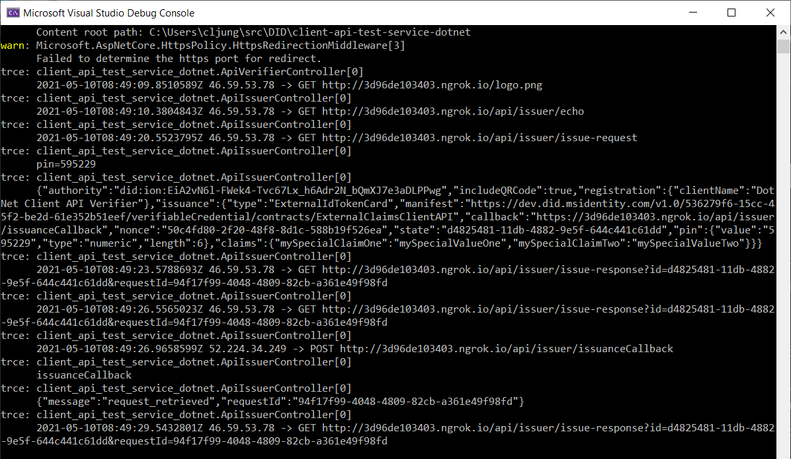

# AspNetCoreVerifiableCredentialsB2C
This sample is an ASP.Net Core sample that is designed to work together with Azure AD B2C in order to have Verifiable Credentials for B2C accounts.
It is very close to the generic dotnet Verifiable Credential [sample](https://github.com/Azure-Samples/active-directory-verifiable-credentials-dotnet), but has some specific modification for B2C.
Even though you could use it for testing generic VC contracts, like VerifiedCredentialExpert, you should use it when integrating with the Azure AD B2C Custom Policies that exists in [this repository](https://github.com/Azure-Samples/active-directory-verifiable-credentials/tree/main/B2C).

## Azure AD B2C and Verifiable Credentials working together - how does it work?

This sample uses two general areas to form the solution. One is the [custom html](https://docs.microsoft.com/en-us/azure/active-directory-b2c/customize-ui-with-html?pivots=b2c-custom-policy) 
and self asserted pages in Azure AD B2C and the other is the [REST API Technical Profile](https://docs.microsoft.com/en-us/azure/active-directory-b2c/restful-technical-profile) in Azure AD B2C. 
The custom html makes it possible to do ajax calls in javascript to generate the QR code. The REST API makes it possible to integrate calls to the VC sample code so that B2C can send claims and query presentation status.
For this to work, you need this VC sample as a backend for B2C to talk to. The custom html and B2C policies are available in the link above.


## Running the sample

### Updating appsettings.json config file

This sample now has all its configuration in the [appsettings.json](appsettings.json) file and you need to update it before you run the app.

In the [appsettings.json](appsettings.json) file, there are a few settings, but the ones listed below needs your attention.
First, `TenantId`, `ClientId` and `ClientSecret` are used to acquire an `access_token` so you can authorize the VC Client API to your Azure Key Vault.
This is explained in the outer [README.md](../README.md#adding-authorization) file under the section `Adding Authorization`. 

The remaining five settings control what VC credential you want to issue and present. 

```JSON
    "ApiEndpoint": "https://beta.eu.did.msidentity.com/v1.0/{0}/verifiablecredentials/request",
    "TenantId": "<your-AAD-tenant-for-VC>",
    "Authority": "https://login.microsoftonline.com/{0}",
    "scope": "bbb94529-53a3-4be5-a069-7eaf2712b826/.default",
    "ClientId": "<your-clientid-with-API-Permissions->",
    "ClientSecret": "your-secret",
    "VerifierAuthority": "did:ion:...your DID...",
    "IssuerAuthority": "did:ion:...your DID...",
    "B2C1ARestApiKey": "your-b2c-app-key",
    "CredentialType": "B2CVerifiedAccount",
    "DidManifest": "https://beta.eu.did.msidentity.com/v1.0/<your-tenant-id-for-VC>/verifiableCredential/contracts/<your-name>",
    "IssuancePinCodeLength": 0
```
- **ApiEndpoint** - If you have an EU Azure AD tenant, then it should read `beta.eu.did`. If not, then remove `.eu.`
- **TenantId** - This is the Azure AD tenant that you have setup Verifiable Credentials in. It is not the B2C tenant.
- **ClientId** - This is the App you have registered that has the VC permission `VerifiableCredential.Create.All` and that has access to your VC Azure KeyVault.
- **VerifierAuthority** - This DID for your Azure AD tenant. You can find in your VC blade in portal.azure.com.
- **IssuerAuthority** - This DID for your Azure AD tenant. You can find in your VC blade in portal.azure.com.
- **CredentialType** - Whatever you have as type in the Rules file(s). The default is `B2CVerifiedAccount`.
- **DidManifest**- The complete url to the DID manifest. It is used to set the attribute `manifest` and it is used for both issuance and presentation.
- **IssuancePinCodeLength** - If you want your issuance process to use the pin code method, you specify how many digits the pin code should have. A value of zero will not use the pin code method.

### Standalone
To run the sample standalone, just clone the repository, compile & run it. It's callback endpoint must be publically reachable, and for that reason, use `ngrok` as a reverse proxy to read your app.

```Powershell
git clone https://github.com/Azure-Samples/active-directory-verifiable-credentials-dotnet.git
cd active-directory-verifiable-credentials-dotnet/tree/main/3-asp-net-core-api-b2c
dotnet build "AspNetCoreVerifiableCredentialsB2Cdotnet.csproj" -c Debug -o .\bin\Debug\netcoreapp3.1
dotnet run
```

Then, open a separate command prompt and run the following command

```Powershell
ngrok http 5002
```

Grab, the url in the ngrok output (like `https://96a139d4199b.ngrok.io`) and Browse to it.

### Docker build

To run it locally with Docker
```
docker build -t aspnetcoreverifiablecredentialsb2cdotnet:v1.0 .
docker run --rm -it -p 5002:80 aspnetcoreverifiablecredentialsb2cdotnet:v1.0
```

Then, open a separate command prompt and run the following command

```Powershell
ngrok http 5002
```

Grab, the url in the ngrok output (like `https://96a139d4199b.ngrok.io`) and Browse to it. Note that the issuer test page is there just to help you do the basic issuance testing. Issuing VCs with this sample is intended to be done via B2C signup policies.

### Together with Azure AD B2C
You follow the instructions and deploy the B2C policies in this github repo [https://github.com/Azure-Samples/active-directory-verifiable-credentials/tree/main/B2C](https://github.com/Azure-Samples/active-directory-verifiable-credentials/tree/main/B2C). 
Not that the TrustFrameworkExtensionsVC.xml file references the endpoints to this API in several places as they work together.

When you have the B2C policies deployed, the steps to test is to

1. Run the B2C policy [B2C_1A_VC_susi_issuevc](https://github.com/Azure-Samples/active-directory-verifiable-credentials/blob/main/B2C/policies/SignUpVCOrSignin.xml) and signup a new user. After you have validated the email, set the password, etc, the final step in the B2C user journey is to issue the new user with a VC.
1. Run the B2C policy [https://github.com/Azure-Samples/active-directory-verifiable-credentials/blob/main/B2C/policies/SigninVC.xml](https://github.com/Azure-Samples/active-directory-verifiable-credentials/blob/main/B2C/policies/SigninVC.xml) to sign in your B2C user via presenting the VC.


### LogLevel Trace

If you set the LogLevel to `Trace` in the appsettings.*.json file, then the DotNet sample will output all HTTP requests, which will make it convenient for you to study the interaction between components.

