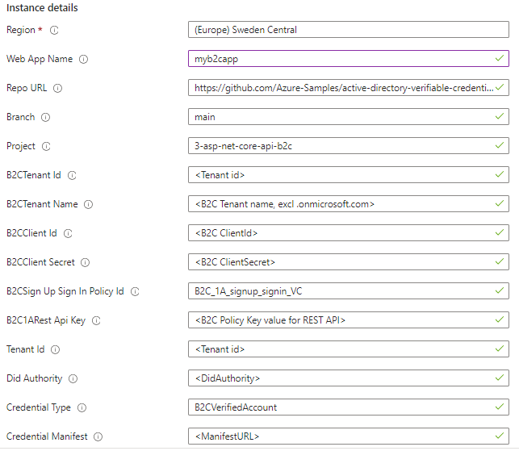
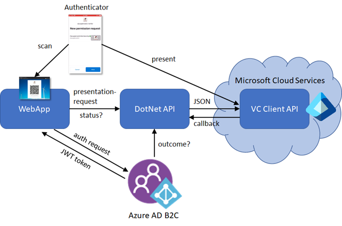

# Verified ID + Azure AD B2C sample
This sample is an ASP.Net Core sample that is designed to work together with Azure AD B2C in order to use Verified ID with B2C.


## Deploy to Azure

Complete the [setup](#Setup) before deploying to Azure so that you have all the required parameters.

[](https://portal.azure.com/#create/Microsoft.Template/uri/https%3A%2F%2Fraw.githubusercontent.com%2FAzure-Samples%2Factive-directory-verifiable-credentials-dotnet%2Fmain%2F3-asp-net-core-api-b2c%2FARMTemplate%2Ftemplate.json)

You will be asked to enter some parameters during deployment about your app registration and your Verified ID details. You will find these values in the admin portal. 



https://portal.azure.com/#create/Microsoft.Template/uri/https%3A%2F%2Fcljungdemob2c.z6.web.core.windows.net%2FARM%2Ftemplate.json

## Azure AD B2C and Verified ID working together - how does it work?

This sample uses two general areas to form the solution. One is the [custom html](https://docs.microsoft.com/en-us/azure/active-directory-b2c/customize-ui-with-html?pivots=b2c-custom-policy) 
and self asserted pages in Azure AD B2C and the other is the [REST API Technical Profile](https://docs.microsoft.com/en-us/azure/active-directory-b2c/restful-technical-profile) in Azure AD B2C. 
The custom html makes it possible to do ajax calls in javascript to generate the QR code. The REST API makes it possible to integrate calls to the VC sample code so that B2C can send claims and query presentation status.
For this to work, you need this VC sample as a backend for B2C to talk to. The custom html and B2C policies are available in the link above.



## Using the sample

To use the sample, do the following:

- Open the website in your browser.
- Step 1
    - Click Sign-in, then sign-up for creating a local account
- Step 2
    - Select `Issue Credential` from home page
    - If you want a credential that can work with FaceCheck, either take a selfie or upload a photo of yourself
    - Click `Issue Credential` to issue yourself a credential
- Step 3
    - Sign out from the app
    - Click Sign-in and select `Verified ID` as the Identity Provider
    - Scan the QR code, present your Verified ID credential, optionally using FaceCheck - and you're signed in
- Step 4
    - Being signed in or not, the app can ask the user to present the Verified ID again whenever required in the app 
    - Click `Verify Credential` in the home page to create a presentation request

## Sample configuraion

This sample now has all its configuration in the [appsettings.json](appsettings.json) file and you need to update it before you run the app.
If you are running the app locally, you need to edit the appsettings.json file. If you are running the app in Azure AppServices, you need to update the
settings in an Azure AppServices deployment. You can use this template [appservice-config-template.json](appservice-config-template.json) and apply it in the Advanced Edit editor.

| Section | Setting | Description |
|------|--------|--------|
| AzureAdB2C | Instance | Update your tenant name https://your-tenant-name.b2clogin.com |
| | TenantId | Your B2C tenant id (guid) |
| | Tenant | Update your tenant name your-tenant-name.onmicrosoft.com |
| | Domain | Update your tenant name your-tenant-name.onmicrosoft.com |
| | B2CName | Update your tenant name (nam excluding .onmicrosoft.com) |
| | ClientId | Client Id (AppId) in the B2C tenant that is used |
| | ClientSecret | Client secret for the client id in the B2C tenant |
| | SignUpSignInPolicyId | Name of your B2C Custom Policy you want to use for sign-in |
| | B2C1ARestApiKey | The value of the B2C_1A_RestApiKey you have configured in the B2C portal |
| VerifiedID | TenantId | Tenant id where Verified ID is setup (can't be the B2C tenant as that is not supported) |
| | ManagedIdentity | true if you are running the app in Azure AppServices with Managed Identity. In that case, you don't need ClientId/ClientSecret/CertificateName |
| | ClientId |  Client Id that has permission to call Verified ID Request Service API | 
| | ClientSecret | Client secret for the app |
| | CertificateName | Enter a certificate name if using certificate based authentication. Leave blank to use client secret |
| | DidAuthority | The DID of your Verified ID authority |
| | CredentialType | Name of the credential type you are using in combination with B2C |
| | CredentialManifest | URL to the credential manifest for your Verified ID credential |
| | IssuancePinCodeLength | Enter value 4-6 if you want issuance to have a pin code. Leave 0 for no pin code |
| | useFaceCheck | If you plan to extend the sample by providing a user photo during issuance, change this flag to true |
| | PhotoClaimName | Name of photo claim |

### Setup

### Entra ID tenant

Verified ID can not be setup in the B2C tenant. Therefor, you need an Entra ID tenant to get this sample to work. You can set up a [free tenant](https://learn.microsoft.com/entra/identity-platform/quickstart-create-new-tenant) unless you don't have one already. 

### Setup Verified ID

[Setup Verified ID](https://learn.microsoft.com/entra/verified-id/verifiable-credentials-configure-tenant-quick) in your tenant and enable MyAccount. 
You do not need to register an app or create a custom Verified ID credential schema.

### Azure subscription

The sample is intended to be deployed to [Azure App Services](https://learn.microsoft.com/azure/app-service/) 
and use [Managed Identity](https://learn.microsoft.com/azure/app-service/overview-managed-identity) for authenticating and acquiring an access token to call Verified ID.
You don't need to do a app registeration in Entra ID.

### Deploy the B2C Custom Policies

You follow the instructions and deploy the B2C policies in this github repo [https://github.com/Azure-Samples/active-directory-verifiable-credentials/tree/main/B2C](https://github.com/Azure-Samples/active-directory-verifiable-credentials/tree/main/B2C). 
Not that the TrustFrameworkExtensionsVC.xml file references the endpoints to this API in several places as they work together.

### Deploy the app

1. Register an app in the B2C tenat as documented [here](https://learn.microsoft.com/azure/active-directory-b2c/tutorial-register-applications)
1. Deploy the sample application to Azure App Services by clicking on the `Deploy to Azure` button above.
1. Enter all the parameters when asked.
1. Run the powershell script below to grant the Entra ID app the permissions required by Verified ID.
1. Update the Redirect URI in the B2C app registration to allow your deployed App Services app. Should be a value like `https://your-app-name.azurewebsites.net/signin-oidc`.
1. Follow the `Using this sample instructions`

### Entra ID app permissions

The Azure AppServices app runs using [Managed Identity](https://learn.microsoft.com/en-us/azure/app-service/overview-managed-identity) for authenticating and acquiring an access token to call Verified ID.
You don't need to do a app registeration in Entra ID. You do need to grant the app the permission to call Verified ID.

1. Make sure Managed Identity is enabled for your App Service app at `Settings` > `Identity`
1. In portal.azure.com, open the `Cloud Shell` in powershell mode and run the following to grant your MSI service principal the permission to call Verified ID.

```Powershell
$TenantID="<YOUR TENANTID>"
$YourAppName="<NAME OF YOUR AZURE WEBAPP>"

#Do not change this values below
#
$ApiAppId = "3db474b9-6a0c-4840-96ac-1fceb342124f"
$PermissionName = "VerifiableCredential.Create.All"
 
# Install the module
Install-Module AzureAD

Connect-AzureAD -TenantId $TenantID

$MSI = (Get-AzureADServicePrincipal -Filter "displayName eq '$YourAppName'")

Start-Sleep -Seconds 10

$ApiServicePrincipal = Get-AzureADServicePrincipal -Filter "appId eq '$ApiAppId'"
$AppRole = $ApiServicePrincipal.AppRoles | Where-Object {$_.Value -eq $PermissionName -and $_.AllowedMemberTypes -contains "Application"}
New-AzureAdServiceAppRoleAssignment -ObjectId $MSI.ObjectId -PrincipalId $MSI.ObjectId ` -ResourceId $ApiServicePrincipal.ObjectId -Id $AppRole.Id
```
