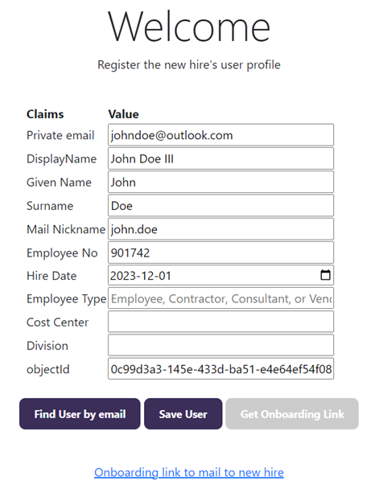
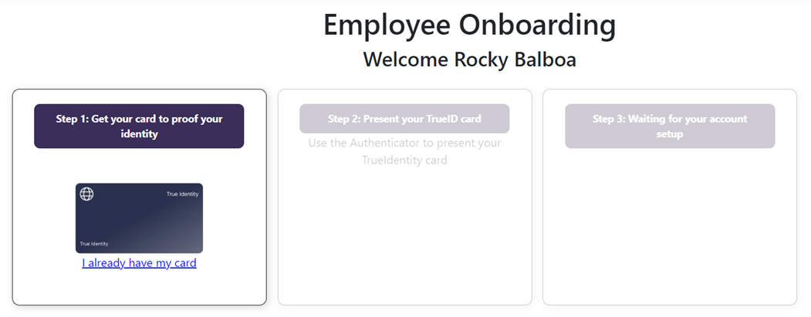

# Employee Onboarding scenario

In the Employee Onboarding scenario a member user account is created which a new hire remotely onboards to.

## Admin persona

In the Employee Onboarding scenario, the admin could be a manager or HR-person. The admin signs in to the app and navigates to `Register New Hire`. 
In that page, the manager registers the details about the new user and saves the user profile for the new hire.
The `private email` will be stored in the [otherMails](https://learn.microsoft.com/en-us/graph/api/resources/user?view=graph-rest-1.0#properties) attribute in the user profile.
When saving the user profile, the user object is added to the TAP group to enable signing in via a TAP code.
The manager then clicks on `Get Onboarding Link` to generate a link that can be emailed to the new hire. The `Onboarding link to mail to new hire` contains a `mailto:` hyperlink 
that will open the managers email app with the link. For demo purposes, you can copy that link and paste it in another browser tab to bypass emailing.

## New Hire persona

The new hire starts the journey via receiving the email with the onboarding link. The new hire should already have Microsoft Authenticator installed on their mobile device. 
That should be part of the richer instructions in the onboarding email being sent, but is excluded here.

## Steps to test

The employee onboarding steps are the following:

1. Use the link in the email which takes the new hire person to the onboarding app (screenshot above).
1. Go to TrueIdentity and do identity verification for remote onboarding. This step results in a TrueIdentity Verified ID credential being issued and that the TrueIdentity websites redirect the user back to the onboarding app.
1. Present the TrueIdentity Verified ID credential to the webapp to proove the new hire's identity.
1. The onboarding app finds the user profile in Entra ID based on the TrueIdentity Verified ID credential claims that are presented. 
1. Follow instructions on how to use the new account name and the temporary access pass (TAP code) to gain initial access to the account. 
1. After new hire have gained access to their account, the onboarding app suggests next steps, which are:
    - Reset the password using Self-Service Password Reset (SSPR).
    - Upload a photo to the user profile
    - Issue a VerifiedEmployee Verified ID credential from [https://myaccount.microsoft.com](https://myaccount.microsoft.com).
    - Go to [https://myapplications.microsoft.com](https://myapplications.microsoft.com).

A few notes:
- The sample instructs the user to do this on the Authenticator, but you could in fact navigate to any page that requries authentication, like [https://myaccount.microsoft.com](https://myaccount.microsoft.com).
- Resetting the password requires [SSPR is enabled](https://learn.microsoft.com/en-us/entra/identity/authentication/tutorial-enable-sspr) for the Entra ID tenant. If the company has a [passwordless](https://support.microsoft.com/en-au/account-billing/how-to-go-passwordless-with-your-microsoft-account-674ce301-3574-4387-a93d-916751764c43) policy, this step can be skipped.
- Upload of a photo requires that the new user have access to do that. In a large company, the photo of the user is probably added by the manager/HR-person when creating the user profile.

