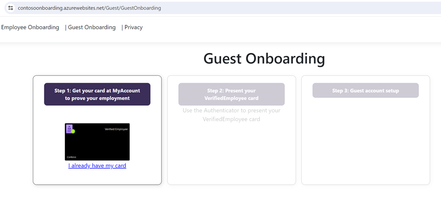

# Guest Onboarding

In the Guest Onboarding scenario, the guest user presents their `VerifiedEmployee` Veified ID credential which triggers the creation of a B2B Guest Account. 
No email is sent to the guest user and invite redemption is made by clicking a link to `MyApps` and signing in.

The sample also implements a Guest Reverification scenario, where the guest user can present the Verified ID again to prove that the user is still an employee of their company.

## Admin persona

The admin needs to sign in and updated the trusted partner list as only users from these partners are allowed to onboard as guest accounts. 
The list can contain a DID or a domain name. The DID is the issuers DID of the VerifiedEmployee credential and the domain name is matched against the linked domain in the VerifiedEmployee presented.


## Guest 

The user who should get a guest account created presents their VerifiedEmployee credential at the below page. The sample then creates a B2B guest user invitation for this user 
and asks the user to go to [MyApps](https://myapps.microsoft.com/?tenantId=...yourtenant...) to sign in to redeem the invitation.



## Guest Reverification

Guest reverification is the scenario where the guest user proves that their employment is still valid with the company and that the guest account should remain.
In order to use this feature, set the `updateGuestUserProfilefromClaims` to `true` and grant permission `User-LifeCycleInfo.ReadWrite.All` to the application.
When presenting the Verified ID VerifiedEmployee credential again, the user profile will be updated and the `EmployeeLeaveDateTime` attribute will be set to the
value of the `expiryDate` in the VC, indicating for how long it should be valid.

```JSON
    "updateGuestUserProfilefromClaims": true
```

## Using FaceCheck

Adding FaceCheck during presentation of `VerifiedEmployee` credential can be added via adding the following to the app config. Setting the `FaceCheckRequiredForGuest` value
to `false` will disable the use of FaceCheck.

```JSON
    "FaceCheckRequiredForGuest": true,
    "sourcePhotoClaimName": "photo",
    "matchConfidenceThreshold": 70,
```

## Can Guest Onboarding work with another credential types other than VerifiedEmployee?

VerifiedEmployee is natural choice as it represents an Entra ID user profile from a company, but others can be used. Which Verified ID credential type you use is up to you as long as you trust it. The Verified ID credential needs to contain claim values for `email` and `displayName`.

If you use a different credential type, you need to update the appsettings.json file for these three entries.

```JSON
    "CredentialTypeGuest": "VerifiedEmployee",
    "GuestEmailClaimName": "mail",
    "GuestDisplayClaimName": "displayName"
```

## Steps to test

The guest onboarding steps are the following:

1. Both host and guest tenant onboards to Verified ID. Host tenant enables [issuance of VerifiedEmployee via MyAccount](https://learn.microsoft.com/en-us/entra/verified-id/verifiable-credentials-configure-tenant-quick#myaccount-available-now-to-simplify-issuance-of-workplace-credentials).
1. Assign the admin user to AppRole `UserAdmin` in order to access `Trusted B2B Partners`
1. Admin signs in, navigates to `Trusted B2B Partners` and updates the trusted partner list for the DID/domain to be tested.
1. Guest user:
    1. opens `https://myaccount.microsoft.com`, signs in with their corporate credentials and clicks `Get Verified ID`.
    1. opens app in browser and navigates to `Guest Onboarding`.
    1. clicks `I already have this card` (or clicks on the step 1 button to launch MyAccount to get one), presents the VerifiedEmployee card and gets the Guest user account created.
    1. clicks on the `MyApps` link, signs in using the host credentials to redeem the guest account invite. 

A few notes:
- Don't try to invite a guest from the host tenant
- If you run this sample multiple times with the same test user, you may get out of sync with the invitation and get an error message in myapps.

