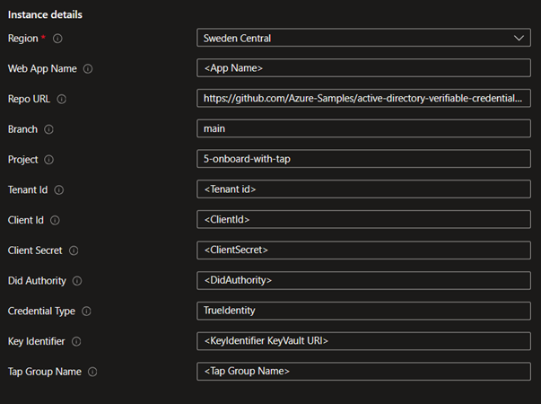

# Verified ID Code Sample for Employee or Guest Onboarding

This sample is show casing onboarding a new hire with the use of [Temporary Access Pass](https://learn.microsoft.com/en-us/entra/identity/authentication/howto-authentication-temporary-access-pass) 
to remotely gain access to their corporate account. It also show casing onboarding a B2B guest user by the use of creating an [invitation](https://learn.microsoft.com/en-us/graph/api/invitation-post) using Microsoft Graph that is redeemed in the application and not via sending an email.

## About this sample

This sample supports **employee onboarding** and **guest onboarding**. 

**Employee onboarding** is the process of pre-registering a new hire and then having the new hire person getting access to the account via remote onboarding. 
The new hire can then onboard and setup their account using TrueIdentity (fictious Identity Verification Provider) and use [Temporary Access Pass](https://learn.microsoft.com/en-us/entra/identity/authentication/howto-authentication-temporary-access-pass) 
to gain access to their new account. 

**Guest onboarding** is the process of setting up a B2B Guest Account by presenting a VerifiedEmployee Verified ID credential from a trusted B2B partner. 
The user doing the guest onboarding needs to have acquired their VerifiedEmployee credential from [MyAccount](https://myaccount.microsoft.com) using their corporate credentials. 
How to enable Verified ID to be available in MyAccount is documented [here](https://learn.microsoft.com/en-us/entra/verified-id/verifiable-credentials-configure-tenant-quick#myaccount-available-now-to-simplify-issuance-of-workplace-credentials).

The sample uses [Microsoft Graph client](https://learn.microsoft.com/en-us/graph/sdks/create-client?tabs=csharp) to interact with Entra Id and create the user profile and create the TAP code, or, create the guest account invite.

## Deploy to Azure

Complete the [setup](#Setup) before deploying to Azure so that you have all the required parameters.

You will be asked to enter some parameters during deployment about your app registration and your Verified ID details. You will find these values in the admin portal. 
What the parameter values are is explained further down in [this](#update-appsettingsjson) section.

## Using the sample

The [Employee Onboarding scenario](EmployeeOnboarding.md) scenario uses two personas:

- An admin that registers the new hire person's user profile and sends an onboarding link to the new hire person.
- A new hire person who onboards to the company and sets up their account.

The [Guest Onboarding scenario](GuestOnboarding.md) scenario uses two personas:

- An admin that updates the list of trusted B2B partners
- A business guest who should have a B2B guest account created

## Setup instructions

[Setup instructions](Setup.md)

## Contents

The project is has some parts that are common for a Verified ID ASPNet Core application and some parts that are specific for providing onboarding. 
The common parts are those that they would be in any dotnet code that interacts with Verified ID. The specific parts are thos that are specific to onboarding a user via TAP.

 
| Employee Onboarding | Description |
|------|--------|
| [Views/Employee/RegisterNewHire.cshtml](Views/Employee/RegisterNewHire.cshtml) | A page that the authenticated manager/HR-representative uses to register the new hire's user account. This page is provided to make use of the sample easier. If you prefer to create the Entra Id user profile via some other process, that works too. In that case, you use this page just to generate the invitation link you email to the new hire. |
| [Views/Employee/Onboarding.cshtml](Views/Employee/Onboarding.cshtml) | A page that contains the onboarding journey and that requires the user to verify their identity using TrueIdentity before setting up their account. |
| [Controllers/EmployeeController.cs](Controllers/EmployeeController.cs) | Implementation that supports the above pages. |

| Guest Onboarding | Description |
|------|--------|
| [Views/Guest/TrustedPartners.cshtml](Views/Guest/TrustedPartners.cshtml) | A page where admins can managed the trusted partners list |
| [Views/Guest/GuestOnboarding.cshtml](Views/Guest/GuestOnboarding.cshtml) | A page for guest account onboarding journey |
| [Controllers/GuestController.cs](Controllers/GuestController.cs) | Implementation that supports the above pages. |

| Common | Description |
|------|--------|
| [Controllers/VerifierController.cs](Controllers/VerifierController.cs) | Controller that creates the Verified ID presentation request for the TrueIdentity credential. |
| [Controllers/CallbackController.cs](Controllers/CallbackController.cs) | Controller that handles the [callbacks](https://learn.microsoft.com/en-us/entra/verified-id/presentation-request-api#callback-events) from Verified ID's Request Service API and that also serves status polling from the UI. |
| [Models/RequestServiceModel.cs](Models/RequestServiceModel.cs) | C# model of the [presentaiton request payload](https://learn.microsoft.com/en-us/entra/verified-id/presentation-request-api#presentation-request-payload). |
| [Helpers/KeyVaultHelper.cs](Helpers/KeyVaultHelper.cs) | Helper code to sign and validate a JWT token using a Key Vault signing key |
| [Helpers/MsalAccessTokenHelper.cs](Helpers/MsalAccessTokenHelper.cs) | Helper code to acquire an access token for Verified ID request Service API |
| [wwwroot/js/verifiedid.uihandler.js](wwwroot/js/verifiedid.uihandler.js) | Updates the browser UI and calls the below |
| [wwwroot/js/verifiedid.requestserviceclient.js](wwwroot/js/verifiedid.requestserviceclient.js) | Javascript browser component that calls the controller APIs and handles the pollign of restest status. |

## More information

For more information, see MSAL.NET's conceptual documentation:

- [Quickstart: Register an application with the Microsoft identity platform](https://docs.microsoft.com/azure/active-directory/develop/quickstart-register-app)
- [Quickstart: Configure a client application to access web APIs](https://docs.microsoft.com/azure/active-directory/develop/quickstart-configure-app-access-web-apis)
- [Acquiring a token for an application with client credential flows](https://aka.ms/msal-net-client-credentials)
